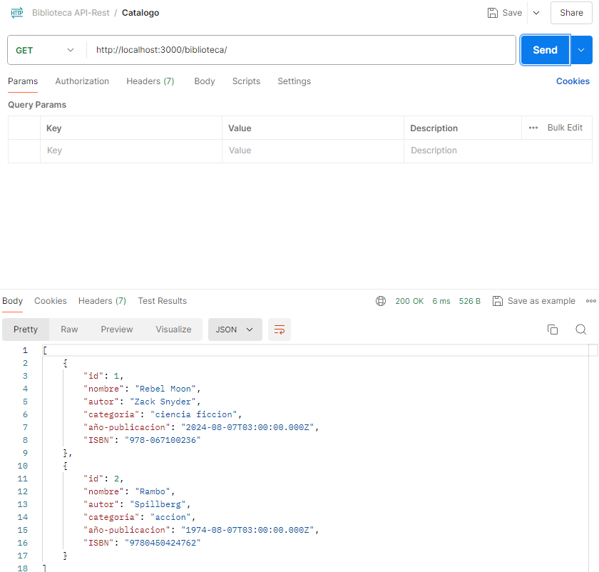

# API de Gestión de Libros de la Biblioteca

Este proyecto es una API RESTful desarrollada en Node.js para gestionar una biblioteca de libros. Permite realizar las operaciones CRUD básicas: obtener todos los libros, obtener un libro por su ID, crear un nuevo libro, actualizar un libro existente y eliminar un libro por su ISBN. 

## Características

- **Obtener todos los libros**: Consulta la lista completa de libros almacenados en la base de datos.
- **Obtener un libro por ID**: Recupera la información de un libro específico utilizando su ID.
- **Crear un nuevo libro**: Permite agregar un nuevo libro con atributos como nombre, autor, categoría, año de publicación e ISBN.
- **Actualizar un libro**: Modifica los detalles de un libro existente utilizando su ID.
- **Eliminar un libro por ISBN**: Borra un libro de la base de datos proporcionando su ISBN.
- **Manejo de errores**: Incluye manejo avanzado de errores para asegurar que todas las solicitudes sean procesadas correctamente, con mensajes de error claros en caso de problemas.
- **Validación de datos**: Se implementan validaciones para asegurar que los datos enviados cumplan con los formatos y requisitos establecidos.

## Esquema de la Base de Datos

La base de datos utilizada en este proyecto se encuentra dentro de la carpeta `script/`,
 y sigue el siguiente esquema:

```sql
CREATE SCHEMA IF NOT EXISTS `rest-api` DEFAULT CHARACTER SET utf8mb4;
USE `rest-api`;

CREATE TABLE IF NOT EXISTS `rest-api`.`libros` (
  `id` INT(11) NOT NULL AUTO_INCREMENT,
  `nombre` VARCHAR(30) NOT NULL,
  `autor` VARCHAR(30) NOT NULL,
  `categoria` VARCHAR(30) NOT NULL,
  `año-publicacion` DATE NOT NULL,
  `ISBN` VARCHAR(13) NOT NULL UNIQUE,
  PRIMARY KEY (`id`))
ENGINE = InnoDB
AUTO_INCREMENT = 10	
DEFAULT CHARACTER SET = utf8mb4;
```
Además, en el mismo archivo se encuentran los datos de prueba:

```sql
INSERT INTO `rest-api`.`libros` (`nombre`, `autor`, `categoria`, `año-publicacion`, `ISBN`) VALUES
('Cien Años de Soledad', 'Gabriel Garcia Marquez', 'Ficción', '1967-05-30', '9780060883287'),
('Don Quijote de la Mancha', 'Miguel de Cervantes', 'Clásicos', '1605-01-16', '9780142437230'),
('El amor en los tiempos del cólera', 'Gabriel Garcia Marquez', 'Romance', '1985-03-06', '9780307389732'),
('La sombra del viento', 'Carlos Ruiz Zafón', 'Misterio', '2001-04-01', '9780143126392'),
('El principito', 'Antoine de Saint-Exupéry', 'Fábula', '1943-04-06', '9780156012195'),
('1984', 'George Orwell', 'Distopía', '1949-06-08', '9780451524935'),
('Fahrenheit 451', 'Ray Bradbury', 'Ciencia Ficción', '1953-10-19', '9781451673319'),
('El nombre del viento', 'Patrick Rothfuss', 'Fantasía', '2007-03-27', '9780756404741'),
('El código Da Vinci', 'Dan Brown', 'Thriller', '2003-04-03', '9780307474278'),
('Los juegos del hambre', 'Suzanne Collins', 'Distopía', '2008-09-14', '9780439023481');
```


## Instalación y Configuración

### Requisitos Previos

- Node.js v14 o superior
- MySQL

### Instalación

1. Clona el repositorio:

    ```bash
    git clone https://github.com/Gonzalo-CR/ProT4_29436010.git
    cd ProT4_29436010
    ```

2. Instala las dependencias:

    ```bash
    npm install mysql2    
    npm install express
    npm install morgan
    npm install dotenv
    npm install cors
    npm install nodemon
    ```

3. Configura las variables de entorno:

    Crea un archivo `.env` en la raíz del proyecto con el siguiente contenido:

    ```env
    DB_HOST=localhost
    DB_USER=root
    DB_PASSWORD=tu_contraseña
    DB_NAME=rest-api
    ```

4. Configura la base de datos:

    Crea la base de datos y la tabla `libros` ejecutando el script SQL proporcionado anteriormente en MySQL Workbench u otra herramienta de administración de bases de datos.

5. Inicia el servidor:

    ```bash
    npm start
    ```

    El servidor estará disponible en http://localhost:3000.

## Uso de la API
### Endpoints Disponibles

- **Obtener todos los libros**: `GET /biblioteca`
  - Retorna un JSON con la lista completa de libros.

- **Obtener un libro por ID**: `GET /biblioteca/:id`
  - Parámetro: id (número de identificación del libro).
  - Retorna un JSON con los detalles del libro.

- **Crear un nuevo libro**: `POST /libroNuevo`
  - Requiere un cuerpo JSON con los atributos: nombre, autor, categoria, año-publicacion, ISBN.
  - Retorna un JSON con el ID del libro insertado o un mensaje de error si el ISBN ya existe.

- **Actualizar un libro**: `PUT /biblioteca/:id`
  - Parámetro: id (número de identificación del libro a actualizar).
  - Requiere un cuerpo JSON con los atributos a actualizar: nombre, autor, categoria, año-publicacion, ISBN.
  - Retorna un mensaje confirmando la actualización o un error si el libro no existe.

- **Eliminar un libro por ISBN**: `DELETE /biblioteca/:ISBN`
  - Parámetro: ISBN (ISBN del libro a eliminar).
  - Retorna un mensaje confirmando la eliminación o un error si el libro no existe.


## Ejemplos de Operaciones CRUD en Postman

- **Obtener todos los libros** (GET /biblioteca)
  

- **Obtener un libro por ID** (GET /biblioteca/:id)
  

- **Crear un nuevo libro** (POST /libroNuevo)
  

- **Actualizar un libro** (PUT /biblioteca/:id)
  

- **Eliminar un libro por ISBN** (DELETE /biblioteca/:ISBN)
  

***Respuesta en la terminal a todas estas acciones:***


## Estructura del Proyecto

El proyecto se organiza en varios archivos clave dentro de la carpeta `src/`, cada uno responsable de diferentes aspectos del funcionamiento de la API.

### `database.js`

Este archivo maneja la conexión a la base de datos MySQL utilizando `mysql2/promise`, lo que permite usar `async/await` para las operaciones de base de datos.

#### Funcionalidad

- **Configuración de la conexión**: La configuración de la conexión se maneja utilizando variables de entorno para asegurar que las credenciales y otros detalles importantes no estén codificados de forma rígida en el código fuente.

    ```javascript
    import mysqlConnection from 'mysql2/promise';
    import dotenv from 'dotenv';

    dotenv.config();

    const properties = {
        host: process.env.DB_HOST,
        user: process.env.DB_USER,
        password: process.env.DB_PASSWORD,
        database: process.env.DB_NAME
    };

    export const pool = mysqlConnection.createPool(properties);
    ```

- **Uso de `createPool`**: Utiliza un pool de conexiones para gestionar eficientemente las conexiones a la base de datos, lo que es esencial para manejar múltiples solicitudes simultáneas en una aplicación de producción.

### `controller.js`

Este archivo contiene la lógica principal de la aplicación, organizando las operaciones CRUD a través de una clase `BibliotecaController`. Cada método de la clase se encarga de una operación específica.

#### Funcionalidad

- **`getAll`**: Recupera todos los registros de libros de la base de datos.

    ```javascript
    async getAll(req, res, next) {
        try {
            const [rows] = await pool.query('SELECT * FROM libros');
            res.json(rows);
        } catch (err) {
            next(err); 
        }
    }
    ```

- **`getOne`**: Obtiene un libro específico usando su id como parámetro.

    ```javascript
    async getOne(req, res, next) {
        const { id } = req.params;
        try {
            const [rows] = await pool.query('SELECT * FROM libros WHERE id = ?', [id]);
            if (rows.length === 0) {
                return res.status(404).json({ message: 'Libro no encontrado' });
            }
            res.json(rows[0]);
        } catch (err) {
            next(err);
        }
    }
    ```

- **`create`**: Inserta un nuevo libro en la base de datos después de validar que los datos sean correctos y que el ISBN no esté duplicado.

    ```javascript
    async create(req, res, next) {
        try {
            validateLibroData(req.body); 

            const { nombre, autor, categoria, 'año-publicacion': añoPublicacion, ISBN } = req.body;

            const [rows] = await pool.query('SELECT * FROM libros WHERE ISBN = ?', [ISBN]);
            if (rows.length > 0) {
                return res.status(400).json({ message: 'El ISBN ya existe. Debe ser único.' });
            }

            const [result] = await pool.query(
                'INSERT INTO `libros` (`nombre`, `autor`, `categoria`, `año-publicacion`, `ISBN`) VALUES (?, ?, ?, ?, ?)',
                [nombre, autor, categoria, añoPublicacion, ISBN]
            );
            res.json({ "Id insertado": result.insertId });
        } catch (err) {
            next(err);
        }
    }
    ```

- **`update`**: Actualiza los detalles de un libro existente en la base de datos usando su id.

    ```javascript
    async update(req, res, next) {
        try {
            validateLibroData(req.body);

            const { id } = req.params;
            const { nombre, autor, categoria, 'año-publicacion': añoPublicacion, ISBN } = req.body;

            const [result] = await pool.query(
                'UPDATE libros SET nombre = ?, autor = ?, categoria = ?, `año-publicacion` = ?, ISBN = ? WHERE id = ?',
                [nombre, autor, categoria, añoPublicacion, ISBN, id]
            );
            if (result.affectedRows === 0) {
                return res.status(404).json({ message: 'Libro no encontrado' });
            }
            res.json({ message: 'Libro actualizado correctamente' });
        } catch (err) {
            next(err);
        }
    }
    ```
- **`delete`**: Elimina un libro de la base de datos usando su ISBN como referencia.

    ```javascript
    async delete(req, res, next) {
        const { ISBN } = req.params;
        try {
            const [result] = await pool.query('DELETE FROM libros WHERE ISBN = ?', [ISBN]);
            if (result.affectedRows === 0) {
                return res.status(404).json({ message: 'Libro no encontrado' });
            }
            res.json({ message: 'Libro eliminado correctamente' });
        } catch (err) {
            next(err);
        }
    }
    ```


#### Función de Validación de Datos: `validateLibroData`
La función **validateLibroData** se encarga de validar los datos de entrada para la creación de un nuevo libro en la base de datos. Esta función asegura que todos los campos requeridos estén presentes y cumplan con los formatos esperados antes de proceder con la inserción en la base de datos.

```javascript
const validateLibroData = (data) => {
    const { nombre, autor, categoria, 'año-publicacion': añoPublicacion, ISBN } = data;

    if (typeof nombre !== 'string' || nombre.trim() === '') {
        throw { type: 'ValidationError', message: 'El campo "nombre" es obligatorio y debe ser una cadena de texto.' };
    }
    if (typeof autor !== 'string' || autor.trim() === '') {
        throw { type: 'ValidationError', message: 'El campo "autor" es obligatorio y debe ser una cadena de texto.' };
    }
    if (typeof categoria !== 'string' || categoria.trim() === '') {
        throw { type: 'ValidationError', message: 'El campo "categoria" es obligatorio y debe ser una cadena de texto.' };
    }
    if (!/^\d{4}-\d{2}-\d{2}T\d{2}:\d{2}:\d{2}.\d{3}Z$/.test(añoPublicacion)) {
        throw { type: 'ValidationError', message: 'El campo "año-publicacion" debe ser una fecha en formato ISO 8601.' };
    }
    if (typeof ISBN !== 'string' || ISBN.length !== 13) {
        throw { type: 'ValidationError', message: 'El campo "ISBN" es obligatorio, debe ser una cadena de texto, y debe tener 13 caracteres.' };
    }
};
```
Esta función es crucial para asegurar la integridad y consistencia de los datos antes de realizar cualquier operación de inserción en la base de datos.

### `routes.js`

Este archivo define las rutas de la API y asigna cada ruta a su correspondiente método en el controlador `BibliotecaController`.

#### Funcionalidad

- **Definición de Rutas**: Aquí se definen las rutas HTTP y se asocian con los métodos del controlador que ejecutan la lógica de la API.

    ```javascript
    import { Router } from "express";
    import { biblioteca } from "./controller.js";

    export const router = Router();

    // Rutas para la biblioteca
    router.get("/biblioteca", biblioteca.getAll);
    router.get("/biblioteca/:id", biblioteca.getOne);
    router.post("/libroNuevo", biblioteca.create);
    router.put("/biblioteca/:id", biblioteca.update);
    router.delete("/biblioteca/:ISBN", biblioteca.delete);
    ```

- **Configuración Modular**: El uso de `Router` de Express permite modularizar las rutas, facilitando la organización y mantenimiento del código.

### `index.js`

Este archivo es el punto de entrada principal de la aplicación. Configura el servidor Express, aplica los middlewares necesarios, y define el comportamiento del servidor.

#### Funcionalidad

- **Configuración del Servidor**: Configura el puerto y los middlewares necesarios como `morgan` para el logging y `cors` para permitir solicitudes desde diferentes orígenes.

    ```javascript
    import express from 'express';
    import morgan from 'morgan';
    import { router } from './routes.js';
    import cors from 'cors';
    import { errorHandler } from './errorHandler.js';

    const app = express();

    // Configuración del puerto
    const port = process.env.PORT || 3000;
    app.set('port', port);

    // Middlewares
    app.use(morgan('dev'));
    app.use(express.json());
    app.use(cors());

    // Rutas de la API
    app.use(router);

    // Middleware de manejo de errores
    app.use(errorHandler);

    // Iniciar el servidor
    app.listen(app.get('port'), () => {
        console.log(`Server is running on port ${app.get('port')}`);
    });

    // Manejo de error si el puerto está en uso
    app.on('error', (err) => {
        if (err.code === 'EADDRINUSE') {
            console.error(`El puerto ${port} está en uso, intentando con otro puerto...`);
            app.listen(port + 1);
        } else {
            throw err;
        }
    });
    ```
## Manejo de Errores en la API

La API implementa un manejo robusto de errores utilizando `try-catch` en los controladores y un middleware global de manejo de errores (`errorHandler`). Esto asegura que cualquier problema durante la ejecución de las operaciones CRUD sea gestionado de manera consistente, proporcionando respuestas claras al cliente y manteniendo la estabilidad del servidor.

### `try-catch` en los Controladores

Cada método en el controlador `BibliotecaController` está envuelto en un bloque `try-catch`. Esto es fundamental para capturar cualquier error que ocurra durante la ejecución de la lógica de negocio o las operaciones con la base de datos.

#### Funcionamiento de `try-catch`:

- **`try`**: Dentro de este bloque se coloca el código que puede potencialmente lanzar un error. En este caso, se trata de consultas a la base de datos y otras operaciones críticas.

    ```javascript
    try {
        const [rows] = await pool.query('SELECT * FROM libros');
        res.json(rows);
    } catch (err) {
        next(err); 
    }
    ```

- **`catch`**: Si ocurre un error en el bloque `try`, el control del programa pasa al bloque `catch`, donde el error es capturado y manejado. En esta API, el error capturado es pasado al middleware global de manejo de errores usando `next(err)`.

#### Beneficios del uso de `try-catch`:

- **Prevención de Caídas del Servidor**: Capturar errores evita que el servidor se caiga debido a excepciones no manejadas.
- **Respuestas Consistentes**: Permite enviar respuestas consistentes al cliente en caso de error, aportando información respecto del mismo, y mejorando la experiencia del usuario.

### Middleware Global de Manejo de Errores (`errorHandler`)

El middleware global de manejo de errores (`errorHandler`) se encuentra en el archivo `errorHandler.js`. Este middleware actúa como un punto central donde todos los errores son capturados y gestionados, asegurando que el cliente reciba una respuesta adecuada.

#### Funcionamiento del `errorHandler`:

- **Captura de Errores**: Cualquier error pasado a `next(err)` en los controladores es capturado por el middleware `errorHandler`.

    ```javascript
    app.use(errorHandler);
    ```

- **Log de Errores**: El middleware registra el error en el servidor, lo que ayuda a los desarrolladores a identificar y solucionar problemas.

    ```javascript
    console.error(err.stack);
    ```

- **Clasificación y Respuesta**: Dependiendo del tipo de error, el middleware envía una respuesta adecuada al cliente. Por ejemplo:

    - **Errores de Validación**: Si se trata de un error de validación (por ejemplo, datos mal formateados), se envía una respuesta con un código de estado 400 y un mensaje descriptivo.
    - **Errores Genéricos**: Para otros errores, se envía una respuesta con un código de estado 500 indicando un error interno del servidor.

    ```javascript
    export const errorHandler = (err, req, res, next) => {
        console.error(err.stack);
        
        if (err.type === 'ValidationError') {
            return res.status(400).json({ message: err.message });
        }
        
        res.status(500).json({ message: 'Ocurrió un error interno en el servidor' });
    };
    ```


\
Este proyecto fue desarrollado para la **Tarea Integradora T4** del módulo II del curso "Desarrollo frontend y backend (Nivel 1)" de **Talentos Digitales 2024** -

#### `GECR 2024`